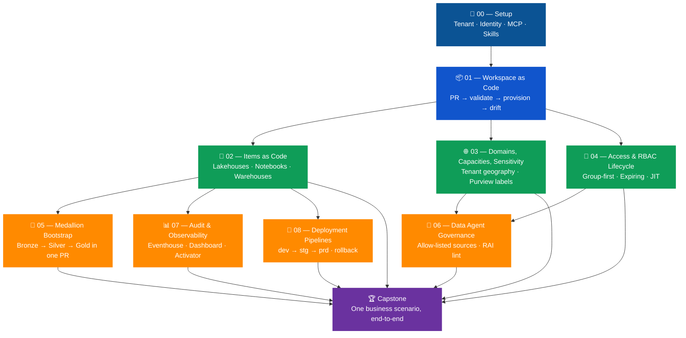
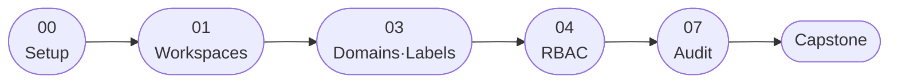
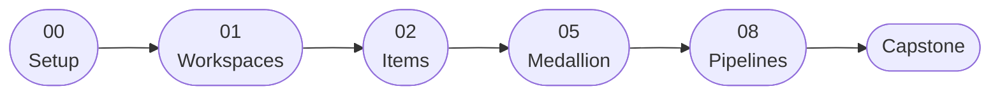
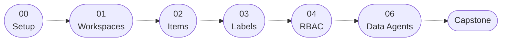
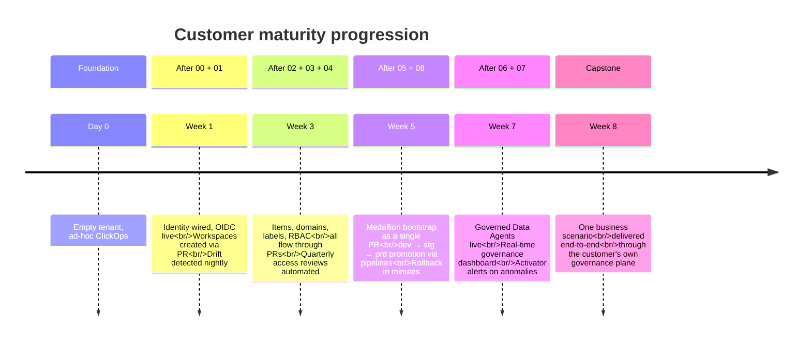

# Agentic Governance Blueprint for Fabric — Challenges at a Glance

> A visual, one-page-per-eye-movement tour of the 10 challenges that make up
> the **Agentic Governance Blueprint for Fabric**. Use this deck-style document
> when introducing the blueprint to customers, sponsors, or new participants.

---

## 1. The blueprint in one picture

**Legend**

| Colour | Layer | What you get |
|---|---|---|
| 🟦 Navy | **Foundation** | Identity + tooling — the prerequisite for everything else |
| 🟦 Blue | **Core loop** | The PR-driven control plane that all other challenges extend |
| 🟩 Green | **Governed control plane** | Items, domains, labels, RBAC — the "front door" governance |
| 🟧 Orange | **Intelligent governance** | Medallion, agents, observability, promotion |
| 🟪 Purple | **Capstone** | Integration across the team's chosen subset |

---

## 2. The 10 challenges, one card each

### 🔐 00 — Setup
> Tenant, identity, and tooling are wired up. The agent can talk to Fabric.

| | |
|---|---|
| **Outcome** | Fabric tenant ready for RVAS (Real Value Acceleration Solutions), SPN federated to GitHub via OIDC, MCP + Skills installed and verified. |
| **Duration** | 90–120 min |
| **Depends on** | — |
| **Customer value** | Zero-secret automation; identity that auditors can defend. |

---

### 📦 01 — Workspace as Code
> Nothing exists in the tenant unless a YAML manifest for it lives in `main`.

| | |
|---|---|
| **Outcome** | Workspaces created, updated, and decommissioned exclusively via Pull Requests. Drift detected nightly. |
| **Duration** | 90–120 min |
| **Depends on** | 00 |
| **Customer value** | Auditable workspace lifecycle; provable "no ClickOps" posture. |

---

### 🧱 02 — Items as Code
> Governance reaches inside the workspace: every lakehouse, notebook, warehouse is declared.

| | |
|---|---|
| **Outcome** | Item manifests with per-kind naming, description, owner, and sensitivity rules. Validator + provisioner extended. |
| **Duration** | 120–180 min |
| **Depends on** | 00, 01 |
| **Customer value** | No more "mystery lakehouses"; column-naming and secret-hygiene rules enforced at PR time. |

---

### 🌐 03 — Domains, Capacities, Sensitivity
> Every workspace lands in the right domain, on the right capacity, with the right label.

| | |
|---|---|
| **Outcome** | Domains and capacities as code; sensitivity labels applied at provision time; label-promotion review flow. |
| **Duration** | 120–180 min |
| **Depends on** | 00, 01 |
| **Customer value** | Chargeback accuracy, Purview-aligned classification, region/capacity allow-lists. |

---

### 👥 04 — Access & RBAC Lifecycle
> Group-first, expiring assignments, JIT break-glass, quarterly access reviews.

| | |
|---|---|
| **Outcome** | Role assignments declared in `access/`; quarterly review workflow auto-opens PRs; break-glass paper-trail. |
| **Duration** | 120–180 min |
| **Depends on** | 00, 01 |
| **Customer value** | Role sprawl eliminated; access reviews become a PR, not a spreadsheet. |

---

### 🥇 05 — Medallion Bootstrap
> One PR scaffolds a fully governed Bronze / Silver / Gold lakehouse set.

| | |
|---|---|
| **Outcome** | Per-tier sensitivity floors, endorsement, owners, schedules — produced by the `e2e-medallion-architecture` skill and captured back into manifests. |
| **Duration** | 180–240 min |
| **Depends on** | 00, 01, 02 |
| **Customer value** | Days-to-hours for new medallion stand-up; governance baked in, not bolted on. |

---

### 🤖 06 — Fabric Data Agent Governance
> Natural-language Q&A agents, but only over allow-listed sources with RAI-linted instructions.

| | |
|---|---|
| **Outcome** | Agent manifests gate data sources by sensitivity, RAI-lint catches refusal/scope gaps, drift detects out-of-band instruction edits. |
| **Duration** | 180–240 min |
| **Depends on** | 00, 01, 02, 03, 04 |
| **Customer value** | Business-user self-service Q&A without the data-exfiltration tail risk. |

---

### 📊 07 — Audit & Observability
> Every governance event lands in an Eventhouse, surfaces in Power BI, trips Activator alerts.

| | |
|---|---|
| **Outcome** | KQL governance store, near-real-time ingestion of GitHub + Fabric activity, "Governance Health" dashboard, anomaly reflexes. |
| **Duration** | 240–300 min |
| **Depends on** | 00, 01, 02 |
| **Customer value** | Governance you can *see*; SLOs around PR throughput, drift, label coverage. |

---

### 🚀 08 — Deployment Pipelines
> dev → stg → prd promotion via Fabric pipelines, gated by PR labels and the same environment approval.

| | |
|---|---|
| **Outcome** | Pipelines as code; label-driven promotion; `revert/prd` rollback flow with a post-mortem PR. |
| **Duration** | 180–240 min |
| **Depends on** | 00, 01, 02 |
| **Customer value** | Repeatable, auditable production releases; rollback in minutes, not meetings. |

---

### 🏆 Capstone — End-to-end integration
> One PR (or short stacked series) exercises every challenge the team completed.

| | |
|---|---|
| **Outcome** | Realistic business scenario shipped through the governance plane; demo of artifacts vs. rubric. |
| **Duration** | 240–360 min |
| **Depends on** | any 5+ challenges |
| **Customer value** | Proof, on the team's own data, that governance does not slow delivery — it accelerates it. |

---

## 3. The four governance layers

```mermaid
flowchart LR
    classDef foundation fill:#0B5394,stroke:#0B5394,color:#fff
    classDef core fill:#1155CC,stroke:#1155CC,color:#fff
    classDef governed fill:#0F9D58,stroke:#0F9D58,color:#fff
    classDef intelligent fill:#FF8A00,stroke:#FF8A00,color:#fff

    subgraph L1["Layer 1 · Foundation"]
        direction TB
        F00["00 — Setup"]:::foundation
    end
    subgraph L2["Layer 2 · Core loop"]
        direction TB
        F01["01 — Workspace as Code"]:::core
    end
    subgraph L3["Layer 3 · Governed control plane"]
        direction TB
        F02["02 — Items"]:::governed
        F03["03 — Domains/Capacities/Labels"]:::governed
        F04["04 — Access &amp; RBAC"]:::governed
    end
    subgraph L4["Layer 4 · Intelligent governance"]
        direction TB
        F05["05 — Medallion"]:::intelligent
        F06["06 — Data Agents"]:::intelligent
        F07["07 — Audit &amp; Observability"]:::intelligent
        F08["08 — Deployment Pipelines"]:::intelligent
    end

    L1 --> L2 --> L3 --> L4
```

---

## 4. Customer outcomes mapped to challenges

| Customer outcome | Delivered by |
|---|---|
| **Zero out-of-band workspaces** | 01 + nightly drift |
| **Provable least-privilege on production data** | 04 (RBAC) + 03 (sensitivity) + 06 (agents) |
| **Faster medallion delivery for new business lines** | 05 + 02 |
| **Audit pack for regulators in < 1 day** | 07 (KQL store + dashboard) |
| **Repeatable, reversible production releases** | 08 (pipelines + rollback) |
| **Trustworthy AI-assisted Q&A over enterprise data** | 06 + 03 + 04 |
| **Chargeback accuracy by domain / cost center** | 03 + 07 |
| **No long-lived secrets in CI/CD** | 00 (OIDC) — runs through all challenges |

---

## 5. Suggested adoption paths

Pick the path that matches your starting posture. All paths share the same first
two steps (Challenges 00 and 01) — that's the irreducible core.

### Path A — Regulated enterprise, governance-first

**Story:** "We need to prove control before we scale workloads."
Skips items/medallion until the control plane is hardened.

### Path B — Data-platform team, delivery-first

**Story:** "We need to ship a governed medallion stack for a new business line by Q-end."
Adds RBAC and audit in a second wave.

### Path C — AI-forward enterprise

**Story:** "We want governed Copilot-style Q&A over our data, and we need the
guardrails *before* the first agent ships."

### Path D — Full blueprint (2-day RVAS)

00 → 01 → (02 + 03 + 04 in parallel by sub-teams) → (05 + 07 + 08 in parallel) → 06 → Capstone

---

## 6. Skills × Challenges matrix

Where Fabric MCP servers and Skills for Fabric show up across the journey.

| Skill / MCP | 00 | 01 | 02 | 03 | 04 | 05 | 06 | 07 | 08 |
|---|:--:|:--:|:--:|:--:|:--:|:--:|:--:|:--:|:--:|
| **Fabric Core MCP** (remote) | ✅ | ✅ | ✅ | ✅ | ✅ | ✅ | ✅ |   | ✅ |
| **Fabric local MCP** (docs / OneLake) | ✅ |   | ✅ |   |   | ✅ |   | ✅ | ✅ |
| `spark-authoring-cli` |   |   | ✅ |   |   | ✅ |   |   |   |
| `spark-operations-cli` |   |   |   |   |   |   |   |   | ✳️ |
| `sqldw-authoring-cli` |   |   | ✅ |   |   | ✅ |   |   |   |
| `sqldw-operations-cli` |   |   |   |   |   |   |   |   | ✳️ |
| `eventhouse-authoring-cli` |   |   |   |   |   |   |   | ✅ |   |
| `eventhouse-consumption-cli` |   |   |   |   |   |   |   | ✅ |   |
| `eventstream-authoring-cli` |   |   |   |   |   |   |   | ✅ |   |
| `powerbi-authoring-cli` |   |   |   | ✳️ |   | ✅ |   | ✅ |   |
| `powerbi-consumption-cli` |   |   |   |   |   |   | ✳️ |   |   |
| `activator-authoring-cli` |   |   |   |   | ✳️ |   |   | ✅ |   |
| `e2e-medallion-architecture` |   |   |   |   |   | ✅ |   |   |   |
| **GitHub Actions + OIDC** | ✅ | ✅ | ✅ | ✅ | ✅ | ✅ | ✅ | ✅ | ✅ |
| **Microsoft Purview** |   |   |   | ✅ |   |   | ✅ | ✅ |   |
| **Microsoft Graph MCP** |   |   |   |   | ✳️ |   |   |   |   |

✅ = used in core tasks · ✳️ = used in stretch goals / optional paths

---

## 7. What "done" looks like — maturity journey

---

## 8. Talking points for executive briefings

Use these four sentences when you have **30 seconds**:

> *"We treat the Fabric tenant as declarative infrastructure. Every workspace,
> item, role assignment, label, agent, and promotion is a YAML file in Git,
> reviewed via Pull Request, applied by a service principal with no long-lived
> secrets. AI agents help authors and reviewers move faster — they never bypass
> the gate. The blueprint covers 10 challenges that take a team from an empty
> tenant to a fully governed control plane in under two days."*

When you have **3 minutes**, add:

- **Identity** is federated (OIDC) — no client secrets anywhere in CI/CD.
- **The validator** is the same code path locally and in CI — no surprises.
- **Drift** runs nightly; out-of-band changes surface as GitHub issues.
- **Skills for Fabric** ship the heavy lifting (medallion, eventhouse, Power BI,
  Activator) — we wrap them in the PR loop so the governance frame holds.
- **Each delivery feeds the next:** customer feedback becomes PRs that add or
  adapt challenges, so the blueprint compounds value over time.

---

## 9. Pointers for deeper reading

| If you want… | Open |
|---|---|
| The participant-facing labs | [`challenges/`](../challenges/) |
| The facilitator runbook | [`docs/delivery-guide.md`](delivery-guide.md) |
| The identity / OIDC design | [`docs/identity-model.md`](identity-model.md) |
| The Workspace-as-code design reference | [`docs/workspace-approval-workflow.md`](workspace-approval-workflow.md) |
| The MCP + Skills install and usage guide | [`docs/mcp-and-skills.md`](mcp-and-skills.md) |
| The shared error catalog | [`docs/troubleshooting.md`](troubleshooting.md) |
| Fabric / governance terms | [`docs/glossary.md`](glossary.md) |
